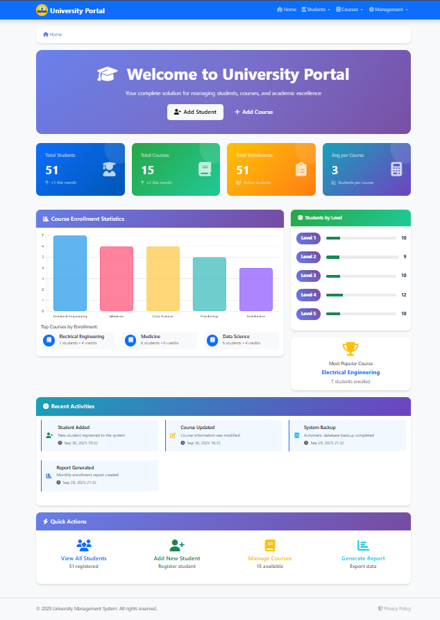
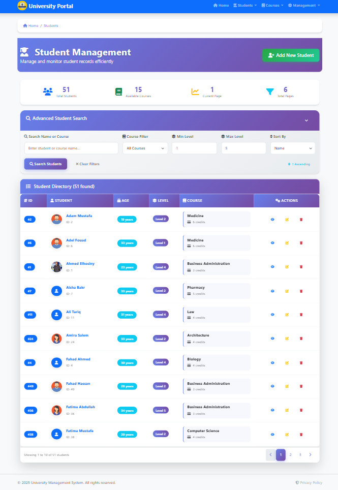
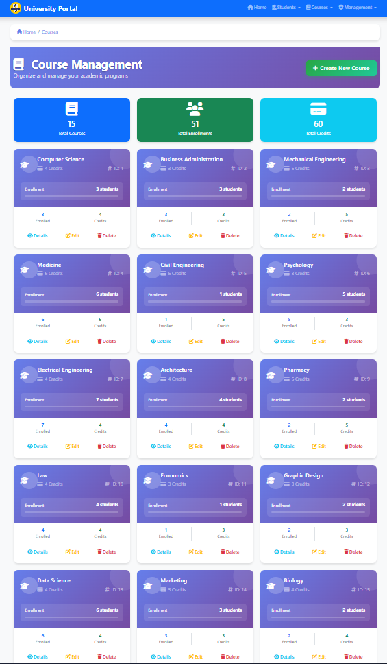

# 🎓 University Portal - Student Management System

[](https://dotnet.microsoft.com/)
[](https://docs.microsoft.com/en-us/dotnet/csharp/)
[](https://getbootstrap.com/)

> Modern, feature-rich university management system built with ASP.NET Core MVC. Manage students, courses, and enrollments with a professional, responsive interface.



## ✨ Features

- ✅ **Complete CRUD Operations** - Students & Courses management
- 🔍 **Advanced Search & Filtering** - Real-time search with multiple filters
- 📊 **Interactive Dashboard** - Statistics, charts, and analytics
- 🖼️ **Image Upload** - Student profile pictures with validation
- 📱 **Responsive Design** - Beautiful UI that works on all devices
- 📄 **Pagination** - Efficient data handling for large datasets
- 🎨 **Modern UI** - Professional gradients and smooth animations
- 💾 **Database Seeding** - Auto-populate with 50 students & 15 courses

## 🚀 Quick Start

### Prerequisites
- [.NET 9.0 SDK](https://dotnet.microsoft.com/download)
- [SQL Server 2019+](https://www.microsoft.com/sql-server) or SQL Server Express

### Installation

```bash
# Clone repository
git clone https://github.com/Ahmed-Elhosiny/university-portal.git
cd university-portal

# Restore packages
dotnet restore

# Update connection string in appsettings.json
"DefaultConnection": "Server=localhost;Database=UniversityDB;Trusted_Connection=True;TrustServerCertificate=True;"

# Run migrations
dotnet ef database update

# Run application
dotnet run
```


Database auto-seeds with sample data on first run! 🎉

## 📸 Screenshots

| Dashboard | Students | Courses |
|-----------|----------|---------|
|  |  |  |

## 🛠️ Tech Stack

- **Backend:** ASP.NET Core 9.0 MVC, C# 14.0
- **Database:** SQL Server, Entity Framework Core 9.0
- **Frontend:** Bootstrap 5.3, Font Awesome 6.4, Chart.js
- **Validation:** Data Annotations, jQuery Validation

## 📁 Project Structure

```
university-portal/
├── Controllers/         # MVC Controllers
├── Models/             # Data models
├── Views/              # Razor views
├── ViewModels/         # View models
├── Validations/        # Validation classes
├── Data/               # Database seeder
├── wwwroot/            # Static files & images
```

## 💾 Database Seeding

Visit `/Seed/Index` for manual control:
- 🌱 Seed 50 students & 15 courses
- 🔄 Reset database for demos
- 🗑️ Clear all data

## 🎯 Key Features

### Student Management
- Add/Edit/Delete students
- Upload profile pictures (JPG, PNG, GIF - Max 5MB)
- Search by name, course, level, age
- Pagination & sorting

### Course Management
- Create and manage courses
- View enrollment statistics
- Visual course cards with student avatars
- Delete protection for enrolled courses

### Dashboard
- Real-time statistics
- Interactive enrollment charts
- Level distribution visualization
- Activity feed

## 🤝 Contributing

Contributions are welcome! Please follow these steps:

1. Fork the project
2. Create your feature branch (`git checkout -b feature/AmazingFeature`)
3. Commit changes (`git commit -m 'Add AmazingFeature'`)
4. Push to branch (`git push origin feature/AmazingFeature`)
5. Open a Pull Request

---

<div align="center">

**⭐ Star this repo if you find it helpful!**

Made with ❤️ using ASP.NET Core

</div>